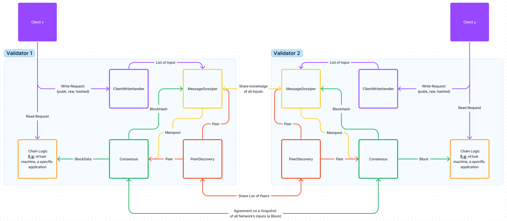

# Welcome to whiteboard chain

## What we build ?

- We build an appchain with simple logic like a todo app to help everyone understand how a blockchain works. Like a normal Todo app on web2. You can use the Create, Start, Stop, Pause, Finish, Assign commands to work with tasks.
- The special thing here is that the input commands you execute will be stored on the blockchain. Please note that only the input command is stored on the blockchain, not the result. In reality, the returned results are not completely stored on the blockchain, the blockchain only stores the inputs, after the block is generated and the inputs are validated, they are processed through logic and returns the result to the user, this logic can be understood similar to Ethereum's EVM. You can find our logic at logic.go.

## Our design appchain



## Appchain consensus mechanism

- It's pretty simple. When a validator receives 3 input commands into the mempool they will create a block hash and broadcast to other validators for consensus.

## How to run ?

### Step 1: Run validator

- Let's take a look in the Makefile.
- You can run validator by using make command or using direct command.

Example:

```
Note: First you need to run the validator at port 8080
Try: "make run1" or "go run main.go 8080 genesis"
Open another terminal and continue:
     "make run2" or "go run main.go 9000 8080"
```

You can continue to run more validators as you like.

### Step 2: Run client

You have 2 options: Option 1: Use user interface, Option 2: Use command line.

#### Option 1:

At the root folder try:

```
     Step 1: "cd client"
     Step 2: "npm install"
     Step 3: "npm run start"
```

Using the interface to interact is quite simple and easy, you can try it yourself.

#### Option 2:

- Go to the folder client: cd cmd/client

- In cmd/client folder we have keypair file for you testing. Now you can use client to interact with validator. We are defaulting the client to send the transaction to the validator whose port is 9000. Ok let's try:

```
Try "make client1" or
"go run main.go send "Hello" -k 8df4135ecefc9a4d054e2c596cd3f56432e683431b27216fea917b01c8ef1fee"
```

\*Note: After -k is the user's private key. This private key and the public key in file public_key.txt need to be a key pair. You can change them based on the key pairs we prepared in the keypair file

It's a bit difficult when you interact using the command line. You need to go to folder cmd/client/main.go, scroll down and you will see the code and some comments, Depending on the command you want to execute, you can uncomment and run "make client1" again.

Here an example:

```
ins := validator.Instruction{
     C:    "Create",
     Data: []byte(`{"Id":"6","Desc":"Description1","Title":"Title1","From":"` + address + `"}`),
	}
```

Okay, done! Discover more for yourself by looking at the running demo and the code we provide, hopefully you will have a deeper understanding of how a blockchain works. Thanks!
